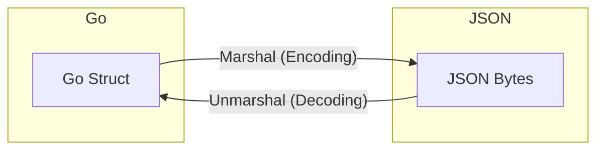

# JSON in Go: A Simple Guide

Classically, JSON is a simple data storage format, something like a dictionary with simple key-value pairs. Along with the web, it's a great way to transfer data in a clean, standard way across various mediums. (We see this with protocols like [JSON-RPC](https://www.jsonrpc.org/specification), which is a fundamental building block for our beloved [MCP](https://modelcontextprotocol.io/).)

While Go isn't "JSON native" like JavaScript, it has a very similar and robust way of handling these data structures using **Structs**.

## Structs

Structs are essentially data blueprints. They pair up an object key with a specific data type. When you create an object from a struct, Go allocates a fixed block of memory for those fields so we can populate them.

```go 
type Message struct {
    Name string
    Body string
    Time int64
}
```

**Note:** Notice how `Name`, `Body`, and `Time` start with capital letters? In Go, only **Exported** (capitalized) fields are visible to the JSON package. If you named them `name` or `body` (lowercase), they would be ignored and your JSON would be empty!

Now, let's create an instance of this struct (this is pure Go data, not JSON yet):

```go
m := Message{"Alice", "Hello", 1294706395881547000}
```

When we convert this to JSON (Marshal it), it essentially becomes a slice of bytes holding our key-value pairs:

```go
b == []byte(`{"Name":"Alice","Body":"Hello","Time":1294706395881547000}`)
```

### Visualizing the Process



Let's see how Go handles this conversion process: **Encoding (Marshal)** and **Decoding (Unmarshal)**.

## Marshal

The `Marshal` function is essentially a way of converting your in-memory Go data structure (the struct) into the JSON format. The implementation in the standard library is simple and clean:

```go
func Marshal(v interface{}) ([]byte, error)
```

See, it's really simple. We name our function `Marshal`, which takes a value `v` of type `interface{}` and returns two things: a slice of bytes (`[]byte`) and an error if anything goes wrong.

Why `interface{}`? This is Go's way of saying "I accept any type." It doesn't matter what data you put in, Marshal will inspect it (using [reflection](https://go.dev/blog/laws-of-reflection)) and figure out how to represent it as JSON bytes.

Here is a full program that takes a variable `m`, marshals (encodes) it, and stores the result in `b`:

```go
package main

import (
	"encoding/json"
	"fmt"
)

type Message struct {
	Name string
	Body string
	Time int64
}

func main() {
	m := Message{"Alice", "Hello", 1294706395881547000}

	b, err := json.Marshal(m)

    // Using %s to print bytes as string, %v for raw bytes
	fmt.Printf("Raw bytes: %v\nError: %v\n", b, err)
    fmt.Println("JSON String:", string(b))
}
```

When you run this, the raw output looks like a slice of numbers (ASCII codes):

```
Raw bytes: [123 34 78 97 109 101 34 58 34 65 108 105 99 101 34 44 34 66 111 100 121 34 58 34 72 101 108 108 111 34 44 34 84 105 109 101 34 58 49 50 57 52 55 48 54 51 57 53 56 56 49 53 52 55 48 48 48 125]
Error: <nil>
```

But if we cast those bytes to a string, voila! Valid JSON:

```json
{"Name":"Alice","Body":"Hello","Time":1294706395881547000}
```

### Struct Tags
Sometimes you want your struct field to be `Name` (Capitalized for Go), but you want the JSON key to be lowercase `"name"`. You can use **tags** for this:

```go
type Message struct {
    Name string `json:"name"` // Becomes "name" in JSON
    Body string `json:"body"`
}
```

### Some Quirks to Remember
- **Map Keys:** JSON only allows strings as keys. So if you use a map in Go, it must be `map[string]T`.
- **Unsupported Types:** You cannot encode Channels, Complex numbers, or Functions.
- **Cycles:** If struct A points to struct B, and B points back to A, Marshal will loop forever (and crash).
- **Pointers:** These are automatically followed. If a pointer is `nil`, it becomes `null` in JSON.

## Unmarshal

Now that we have data stored as JSON bytes, we want to decode it back into something Go can understand (our Struct). This effectively inverts the Marshal function.

```go 
func Unmarshal(data []byte, v interface{}) error
```

If you take a look, `Unmarshal` accepts two values:
1. `data`: The slice of bytes containing our JSON.
2. `v`: A **pointer** to the variable where we want to store the result.

It returns an `error` if the parsing fails.

**Crucial detail:** We pass `v` as a pointer (using `&`) so that `Unmarshal` can modify that variable directly in memory. If we didn't pass a pointer, it would just modify a copy, and our original variable would stay empty!

Let's see this in action:

```go 
package main

import (
	"encoding/json"
	"fmt"
)

type Message struct {
	Name string
	Body string
	Time int64
}

func main() {
    // 1. Setup our JSON bytes (simulating data we received)
	m := Message{"Alice", "Hello", 1294706395881547000}
	b, _ := json.Marshal(m)
	fmt.Println("Original JSON:", string(b))

	// 2. Prepare a place to hold the decoded data
    var um Message

    // 3. Unmarshal! Pass the bytes (b) and the address of um (&um)
	err := json.Unmarshal(b, &um)

    if err != nil {
        fmt.Println("Error:", err)
    }

	fmt.Printf("Decoded Struct: %+v\n", um)
    fmt.Println("Name:", um.Name)
}
```

When we run this, we see that `um` has been populated with the data from our JSON bytes:

```
Original JSON: {"Name":"Alice","Body":"Hello","Time":1294706395881547000}
Decoded Struct: {Name:Alice Body:Hello Time:1294706395881547000}
Name: Alice
```

Go is also very forgiving here. If the JSON has fields that don't exist in your struct, it simply ignores them. If your struct has fields missing from the JSON, they just stay as their default values (empty strings or zeros). This makes it very robust for real-world APIs!

---

Major inspirations and examples for this blog came from this official go blog - https://go.dev/blog/json

I would also suggest you to checkout the official encodings/json package to see how the whole package was actually built - https://pkg.go.dev/encoding/json
